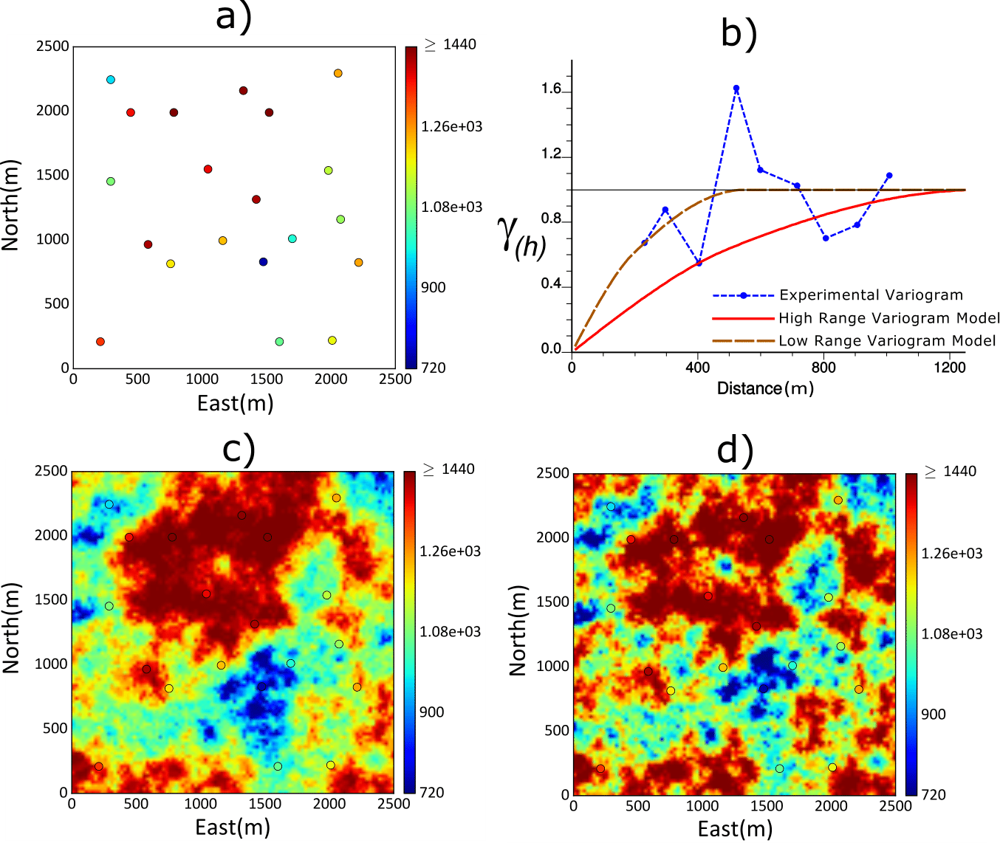

# Uncertainty-in-Spatial-Correlation

This work has been published by **Mehdi Rezvandehy** and **Clayton V. Deutsch** at [Journal of Petroleum Geoscience](https://doi.org/10.1144/petgeo2016-161) https://doi.org/10.1144/petgeo2016-161. **Python** implementation for calculating uncertainty in spatial correlation (variogram) and how to incorporate this uncertainty in geostatistical modeling is presented. If you have any question about the approach and implementation, please email at [Mehdi Rezvandehy](rezvande@ualberta.ca).

## Abstract
**Inferring a stable variogram model (spatial correlation) from widely-spaced data is a longstanding challenge. Correct uncertainty in the calculated variogram should be quantified and incorporated in geostatistical modeling. A new approach of variogram uncertainty is presented by computing the degrees of freedom. Variogram realizations are drawn from the uncertainty interval of lag distances honoring the correlation between lags. The realizations, respecting the correlation between lag distances of different directions, are transferred to geostatistical simulation to incorporate variogram uncertainty in the final numerical models.**

## Introduction
An important challenge in reservoir management is establishing reliable numerical geological models of all required rock and fluid properties including porosity, permeability and  water saturation. These numerical models are driven by conceptual geology, seismic, production history and well data that are widely-spaced early in exploration. The variogram model is required by most geostatistical approaches to build these numerical models. Variogram modeling fits an analytical model to the experimental variogram computed from the data to filter noise in the experimental points and provide a model for all possible distances and direction. 

The analytical variogram model is uncertain since there is unavoidable uncertainty associated with the experimental variogram. **Figure 1** shows a 2-D synthetic example of permeability with 20 wells (see Fig. 1-a). **Figure 1**-b shows omnidirectional (azimuth $0^{\circ} \pm 90^{\circ} $) experimental variogram of the 20 wells where a reliable analytical variogram model cannot be fitted to the experimental variogram due to high variogram uncertainty; two high and low range analytical variogram models are fitted to demonstrate the impact of different variogram models. **Figure 1**-c and 1-d show one realizations of sequential Gaussian simulation (SGS) of well data in **Figure 1**-a using high range variogram model (Fig. 1-c) and low range variogram model (Fig. 1-d). The difference between
realizations is due to different variogram models; high variogram range leads to high continuity (see Fig. 1-c) and low variogram range leads to more heterogeneity (see Fig. 1-d). Thereby, using one variogram model for geostatistical simulation may lead to an unrealistic final model especially in presence of sparse well data.} Variogram uncertainty could be calculated and incorporated in the final model. Although there are many references on calculating and using the variogram, few authors have considered variogram uncertainty. The current approaches of variogram uncertainty are based on a sampling scheme  or the covariance matrix of the experimental variogram. These methods are not robust and lead to a very high variogram uncertainty that may bias the final model (see **Figure 1** for the impact of variogram uncertainty). 

A new approach of quantifying variogram uncertainty is presented. Incorporating the correct variogram uncertainty in geostatistical reservoir models reduces risk in reservoir decision-making since the variogram often has a direct impact on flow simulation. 

**Figure 1**: *Synthetic example of showing the impact of low and high range variogram models on geostatistical simulation. (a) A 2D synthetic example of permeability with 20 wells. (b) Omnidirectional (azimuth $0^{\circ} \pm 90^{\circ} $) experimental variogram of the 20 wells; a reliable analytical variogram model cannot be fitted due to high variogram uncertainty; two high and low range analytical variogram models are fitted. (c) One realizations of SGS using high range variogram model. (d) One realizations of sequential SGS  using a low range variogram model. The difference between **Figure**-c and **Figure**-d is due to different variogram models.*

##  Proposed Workflow

The uncertainty in the variogram is calculated by the degrees of freedom of each lag distance to build the Chi-square distribution. After building the Chi-square distribution of each lag, variogram realizations should be drawn from the uncertainty interval of the variogram lags (Figure 2) and used in geostatistical simulation to incorporate variogram uncertainty in the final model. These realizations should preserve the correlation between lags. Otherwise, the variogram realizations will be noisy and unrealistic. LU (lower-upper matrix factorization) simulation can be applied with the correlation matrix of lag distances. The correlated Gaussian realizations are back-transformed to the marginal Chi-square distribution of each lag distance.

**Figure 2**: *Schematic of six variogram realizations drawn from the variogram distribution of lag distances: the blue curve is the Chi-square distribution for each lag distance, the red dot is the mean of the each Chi-square distribution (the fitted variogram model) and the gray lines are the correlated variogram realizations.*

